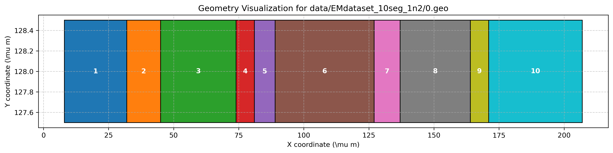
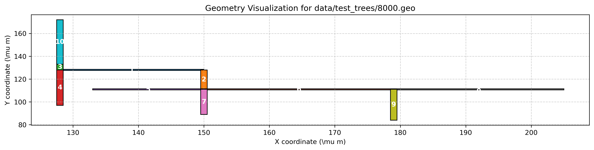

# Multi2DPINN-EM

This repository contains the implementation of a Multi-stage 2D Physics-Informed Neural Network (PINN) for Electromigration (EM) modeling. 

### How to use

1. **Environment Setup**: Create a conda environment from `environment.yml`.
   ```bash
   conda env create -f environment.yml
   conda activate pinn
   ```

2. **Data Generation**: We used the scripts in the `data_gen/` folder to create a synthetic dataset for both first stage and second stage training.

3. **Train First Stage Model**: Train the supervised model to detect the stress in a single wire.
   ```bash
   python train_ss.py --data-path ./data/EMdataset_10seg_1n2/
   ```

4. **Train Second Stage Model**: After the first stage is done, train the second stage model to predict boundary conditions and AFD.
   ```bash
   python train_afd.py --data-path ./data/test_trees/ --model-path ./run/first_stage/EMdataset_10seg_1n2/
   ```

### First and Second Stage Visualization

- **First Stage**: In the first stage, the base structure components and initial segments are plotted to visualize the foundational topology.
  
  

- **Second Stage**: The second stage visualizes the complex, refined wire branching or full topology iterations derived from the models. The multi-stage representation visually distinguishes between parent and child segments in the wire progression. 
  
   
